# Word Wheel

[Word Wheel](https://flashdrag.github.io/word-wheel) is JavaScript educational game in which the user guesses words by their definitions. After a player has selected a certain topic of words and starts the game, the app gets a random word on this topic from the local array and searches for a definition in the online dictionary using api. If the definition succesfully finded, the app shows it to the user, and the word itself is hidden behind flip cards.

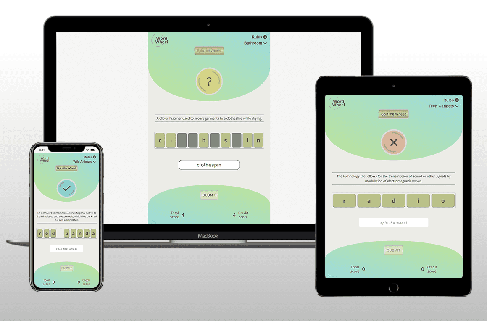

## Table of Contents
- [**User Experience UX**](#user-experience-ux)
  - [User Stories](#user-stories)
  - [Wireframes](#wireframes)
  - [Design Choices](#design-choices)
    - [Game Structure](#game-structure)
    - [Typography](#typography)
    - [Color Scheme](#color-scheme)
- [**Features**](#features)
  - [Data](#data)
    - [Parser](#parser)
    - [Topics](#topics)
    - [Words](#words)
    - [Definitions](#definitions)
  - [Game Menu](#game-menu)
    - [Topic dropdown menu](#topic-dropdown-menu)
    - [Rules](#rules)
  - [Game Start](#game-start-spin-the-wheel-button)
  - [Wheel](#wheel)
  - [Definition](#definition)
  - [Hidden/Revealed word](#hiddenrevealed-word)
  - [Input field](#input-field)
  - [Submit button](#submit-button)
  - [Score section](#score-section)

- [**Technologies Used**](#technologies-used)
- [**Testing**](#testing)
- [**Deployment**](#deployment)
- [**Credits**](#credits)

## User Experience (UX)

### User Stories
- #### Firt time user
  - As a first time player, I want to see the game instructions/rules.
  - As a first time user of the game, I want to easily understand the aims of the game.
  - As a first time user of the game, I want to be able to start the game easily.
  - As a first time player, I want to be able select a topic of the words

- #### Returning user
  - As a returning user of the game, I want to be able to start the game again.
  - As a returning user, I want to select other topics of the words
  - As a returning user, I want to learn the meanings of new words

- #### Frequent user goals
  - As a frequent user, I want initiates and controls game actions.
  - As a frequent user, I want see progress indicators.
  - As a player, I want to be able to spell out a word if the definition is hard to understand.
  - As a frequent user, I want to discover an intuitive interface that will guide me through all the stages of the game.
  - As a frequent user, I want to contact with the game developer.
  - As a frequent user, I want get all interaction feedback.
  - As a frequent user, I want to be notified of all errors resulting from my actions.

[Back to top](#table-of-contents)

### Wireframes

The Word Wheel game was designed based on wireframes produced in [Balsamiq](https://balsamiq.com/). All design features were implemented.

| Desktop|Tablet|
|-|-|
| 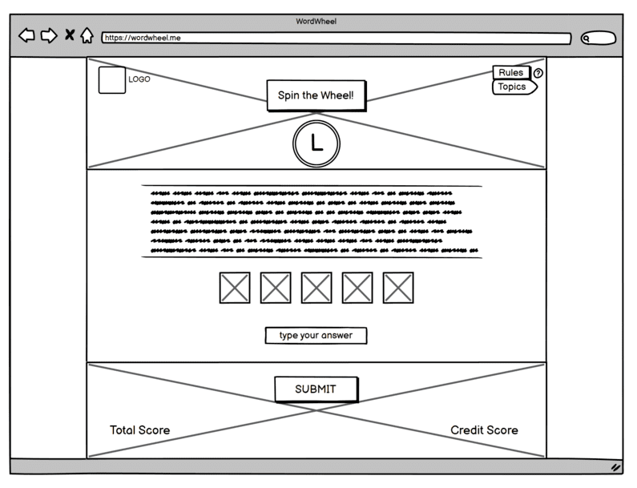 | 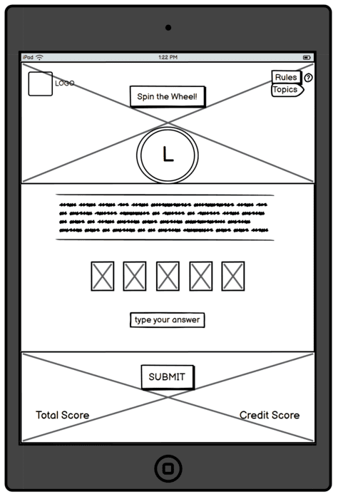 |

[Back to top](#table-of-contents)

### Design Choices

The game is designed with interactive and intuitive interface. Consistency evident across all page and covers interactivity as well as design. User actions are confirmed where appropriate, feedback is given at all times.
The appearance and UI design is quite user-friendly, simple and responsive. The game page was designed to fit any mobile screen resolution both vertically and horizontally.

- #### Game Structure
  The game is based on a single interactive page with significant interactive functionality. The page is designed in a such way to guide the user through all stages of the game from top to bottom in a consistent and intuitive manner, reducing cognitive overload for a better user experience.
  The main js script is attached to the index.html page as a module.
  ES6 modules with import and export statements are used to get data.
  404.html page for defensive design.

- #### Typography
  The main game font is [Open Sans](https://fonts.google.com/specimen/Open+Sans). It's is a clean and modern sans-serif typeface designed by Steve Matteson and commissioned by Google.
  The font was chosed as it especially designed for web and mobile interfaces and it is incredibly readable in small sizes which plays a big role in the responsive design of the game page.

- #### Color Scheme
  The game design meets accessibility requirements including sufficient contrast between background and foreground colours.
  The basic color is Light Moss Green. The top and bottom sections of the game page as well as the buttons are implemented in a minimalist modern style using a gradient from two base colors such as Yellow-Green and Crystal.
  Red tones and brighter Yellow-Green are used to accentuate more important objects of the game. Muted shades of the same color scheme are used for temporarily inactive objects.

  

[Back to top](#table-of-contents)

## Features

The Word Wheel game is designed to strictly adhere to accessibility guidelines across all sections of the page and all interactive elements.
Any interaction causes a positive response to the user through the semantic structured information, colors, clear and unambiguous navigation structures.

### Data
Topic names and words are stored in the [vocabData.js](https://github.com/FlashDrag/word-wheel/blob/master/assets/js/vocabData.js) file as a Javascript object. Topic name is a property, array of relevant words is a value. The definition of words is retrieved automatically makes HTTP request to the [Free Dictionary API](https://dictionaryapi.dev).
- #### Parser
  This script is NOT a part of the GAME!
  Node.js is required!

  This [Parser](https://github.com/FlashDrag/word-wheel/blob/master/assets/data/parser.js) is an additional script that simplifies the work for developer and helps to get words from the external file and add them to the game.
  Manual for the parser inside the [script](https://github.com/FlashDrag/word-wheel/blob/master/assets/data/parser.js).

- #### Topics
  The Topic Dropdown list generated from the properties of the Javascript object `topicWords` which is in [vocabData.js](https://github.com/FlashDrag/word-wheel/blob/master/assets/js/vocabData.js) file and populate the dropdown menu with a list of topics. The dropdown list is updated every time the user clicks on the `Topic` button and is displayed to the user.
  If the array of words is exhausted during the game, the js object with the name of the topic is removed from the vocabData.js file, which is notified to the user.

- #### Words
  New words can be added to the game using the [Parser](https://github.com/FlashDrag/word-wheel/blob/master/assets/data/parser.js) or directly into the array of the relevant topic in the Javascript object `topicWords` found in the [vocabData.js](https://github.com/FlashDrag/word-wheel/blob/master/assets/js/vocabData.js) file.
  When the user starts a new game cycle, the app extracts a random word from the array of the Javascript object `topicWords` for the chosen topic. If the word fails the validation, it is removed from the array and a new random word is extracted.

- #### Definitions
  When a suitable word is found, the app makes a asynchronous HTTP request using the [Fetch API](https://developer.mozilla.org/en-US/docs/Web/API/Fetch_API) to the [Free Dictionary](https://dictionaryapi.dev) and gets the definition of this word. If no definition is found, the app extracts the new word from the array and makes a new request.

[Back to top](#table-of-contents)

### Game Menu
  The game menu includes two buttons (`Topics` and `Rules`) and was implemented in such a way that the user can read the game instructions/rules and select the topic of words which is an integral part of the game.
  The nav menu located on the top right corner of the game page for convenient user access. The menu buttons respond to mouse hover and change text color to brighter to give user feedback. Also, if the user tries to start the game but the topic has not yet been selected, the `Topics` button is temporarily highlighted.

  Menu|Highlighted Menu
  |-|-|
  |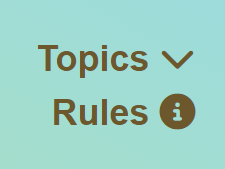||

- #### Topic dropdown menu
  The choice of topics is implemented by clicking on the `Topics` button in the form of a drop-down menu. The list of topics updated and displays every time when the user clicks on `Topics` button. If the user tries to start a new game cycle but no topic is selected, the user will be prompted to select one.
  When the topic is selected by the user from dropdown menu, the app changes the button name for the name of the selected topic.
  During the game cycle, the app will refer to the button's `data-value` attribute which stores the row topic name, to search for the relevant word.
  The topic name will be removed from the dropdown menu during the game if the topics word list is exhausted. The user can select a topic of the words at any time of the game, but a new word from the topic will be received only when the cycle of current game is completed.

  Dropdown menu|Selected Topic
  |-|-|
  |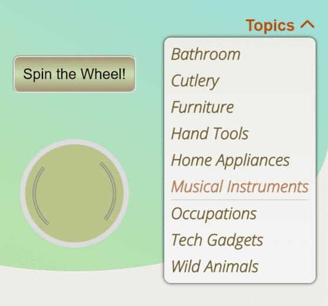|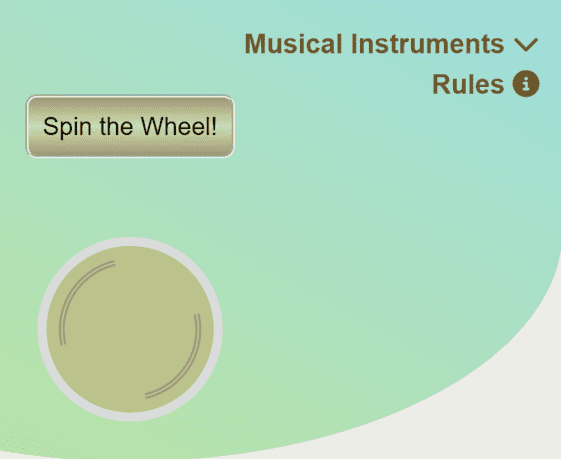|

- #### Rules
  The rule set can be opened at any time by the user, as he/she may need to clarify some details of the game.
  The rules section opens on the same page on top of the game window.
  On the rules pages, in addition to the ruleset itself, the user also has access to a link to the game repository itself which opens in a new page.

  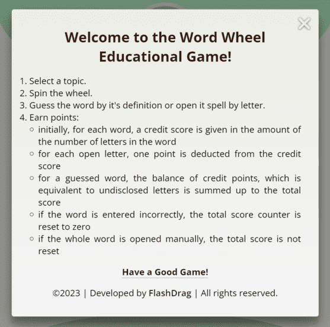

[Back to top](#table-of-contents)

### Game Start (`Spin the Wheel` button)
Clicking on the `Spin the Wheel` button once initiates the launch of the game cycle and the start of the wheel animation, after which the button is deactivated to prevent the creation of a new game cycle instance. The user can also spin the wheel by pressing the `Space` key on the keyboard.

|||
|-|-|
|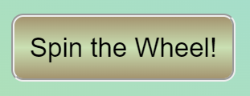||

### Wheel
At the beginning of the game cycle, the animation of the wheel spinning and the random change of letters that are not associated with the word is started
If the data is successfully extracted, the color of the wheel changes to yellow and a question mark is displayed inside.
If the user entered the wrong answer or opened the whole word manually, the color changes to red and X mark is displayed inside.
If the user gave the correct answer, the color changes to turquoise and the checkmark is displayed inside.

|||
|-|-|
|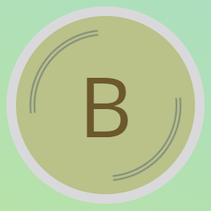||
|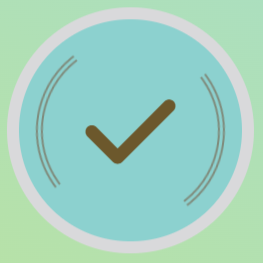|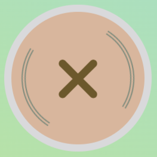|

### Definition
The word definition is obtained by HTTP request to the [Free Dictionary API](https://dictionaryapi.dev), parsed, validated and displayed to the user.
If the keyword itself was found in the definition, it is replaced with asterisks. Also if the definition is too long, it is truncated before being shown to the user.

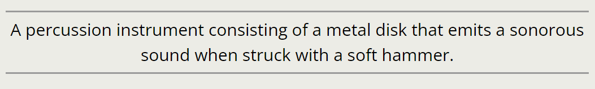

### Hidden/Revealed word
Initially, the keyword is hidden behind the flipped tiles. The user has the ability to reveal each letter separately by clicking on a tile if it is difficult to guess the whole word. At the end of the game cycle, after the user clicks on the `Submit` button the word is revealed completely, regardless of the outcome of the game.

|Hidden word|Revealed word|
|-|-|
|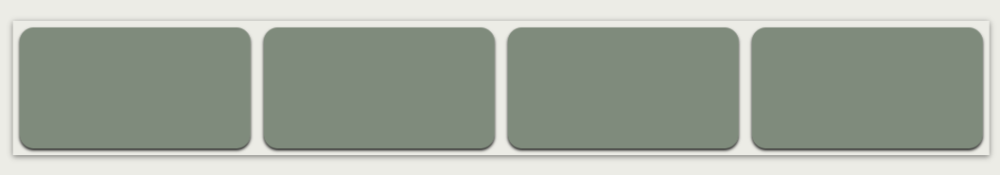|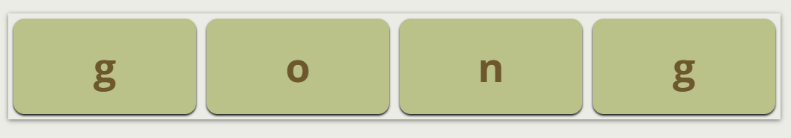|

### Input field
While the game is not active, the input field is disabled and the placeholder text prompts the user to `spin the wheel`. When the user has started the game cycle, the input field becomes active and the user is prompted to enter a answer.

|Disabled Input field|Active Input field|
|-|-|
|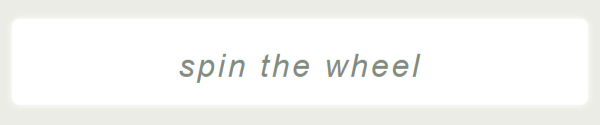|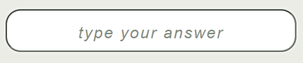|

### Submit button
While the game is not active, the `submit` button is disabled. When the user has started the game cycle, the `submit` button becomes active. If the button was clicked by the user and the input field is empty, an alert appears prompting the user to enter an answer. The user can also submit the answer by pressing the `Enter` key on the keyboard.

|Disabled Submit button|Active Submit button|
|-|-|
|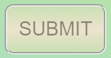|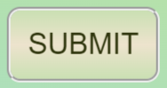|

### Score section
At the start of each game cycle, a credit score is given that adds up to the number of letters in the word. For each open letter, one point is deducted from the credit score. For a guessed word, the balance of credit points, which is equal to the number of hidden letters, is added to the total score. If the word is entered incorrectly, the total score counter is reset to zero. If each letter tile is clicked, revealing the letters, the total score is not reset.

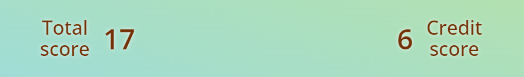

[Back to top](#table-of-contents)

## Technologies Used
- [HTML5](https://developer.mozilla.org/en-US/docs/Glossary/HTML5) - building, structuring and presenting project
- [CSS3](https://developer.mozilla.org/en-US/docs/Web/CSS) - game styling
- [Java Script](https://developer.mozilla.org/en-US/docs/Web/JavaScript) - game functionality
- [Fetch API](https://developer.mozilla.org/en-US/docs/Web/API/Fetch_API) - request a data from the [Free Dictionary API](https://dictionaryapi.dev)
- [Node.js](https://nodejs.org/) - JavaScript runtime environment. Used for get words from the external file and add them to the game.
- [WSL - Ubuntu](https://ubuntu.com/wsl) - terminal environment
- [Balsamiq](https://balsamiq.com) - wireframes
- [VScode](https://code.visualstudio.com) - code editing
- [GIT](https://git-scm.com/), [GitHub](https://github.com/) - tracking, storing, hosting project
- [Chrome DevTools](https://developer.chrome.com/docs/devtools) - inspecting and debugging code
- [Adobe Photoshop](https://www.adobe.com/products/photoshop.html) - favicon, readme support images
- [iloveIMG](https://www.iloveimg.com) - compressing and resizing readme support images
- [NameCheap](https://www.namecheap.com) - Custom Domain name

[Back to top](#table-of-contents)

## Testing
See [TESTING.md](https://github.com/FlashDrag/word-wheel/blob/master/docs/TESTING.md) for an overview of the game testing and debugging.

[Back to top](#table-of-contents)

## Deployment
The Live link is https://flashdrag.github.io/word-wheel

The app is hosted on GitHub pages and used a custom domain, which is registered via Namecheap [Educational Promotion](https://nc.me/).
The game also can be accessed using link: https://www.wordwheel.me

Here you can find instructions:
[How to register a domain at nc.me](https://www.namecheap.com/support/knowledgebase/article.aspx/9687/35/how-to-register-a-domain-via-our-educational-promotion-at-ncme/)

#### To deploy the project:
1. In the [GitHub repository](https://github.com/FlashDrag/word-wheel), navigate to the *Settings* tab.
2. Once in Settings, navigate to the *Pages* tab on the left hand side.
3. In the *Build and deployment* section under *Branch*, select the **master** branch and click *Save*.
4. Once the master branch has been selected, the page will be automatically refreshed and a display indicates the successful deployment and the link to the address.

#### To run the game on a local machine:
1. Go to the [WordWheel Github Repo](https://github.com/FlashDrag/word-wheel)
2. Click on the green *Code* button and *Download ZIP*
3. Extract the ZIP file on your local machine
4. Run the *index.html* file in a browser

#### To clone the repo:
1. Go to the [Word Wheel Github Repo](https://github.com/FlashDrag/word-wheel)
2. Click the *Code* button to the right of the screen and copy the *HTTPs* link there
3. Open a GitBash terminal and navigate to the directory where you want to locate the clone
4. Type `git clone` and paste the copied *HTTPs* link, press the *Enter* key to begin the clone process

[Back to top](#table-of-contents)

## Credits
### Code
The [Word Wheel](https://flashdrag.github.io/word-wheel) game based on my own implementation of code, applying what I've learned from [CodeInstitute Full Stack Developer Course](https://codeinstitute.net/ie/full-stack-software-development-diploma/) and other tutorials.

### Content
- [Google Fonts](https://fonts.google.com) - fonts
- [FontAwesome](https://fontawesome.com) - icons
- [Dictionary API](https://dictionaryapi.dev) - Free Dictionary API for words definitions
- [Visual Dictionary](https://visualdictionary.org) - word sets
- [Logo](https://logo.com) - game logo

[Back to top](#table-of-contents)