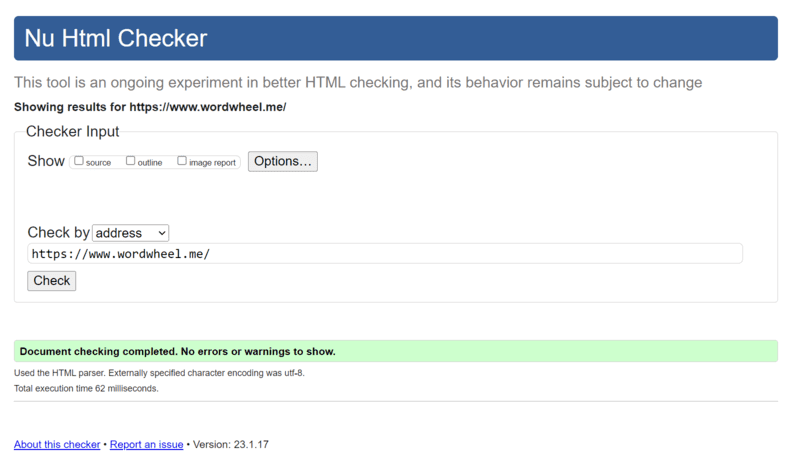
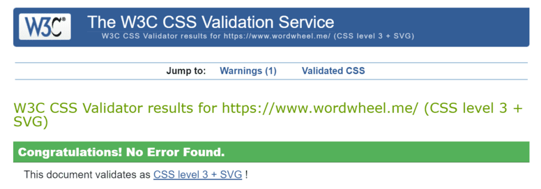
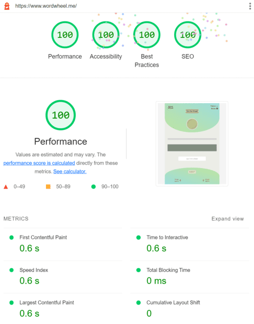
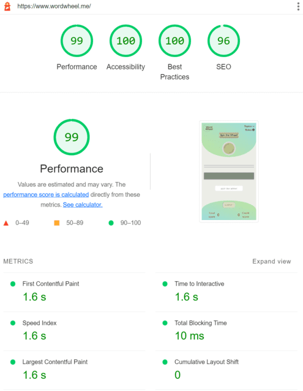

# Testing

## Contents

- [Manual Testing](#manual-testing)
- [Compatibility Testing](#compatibility-testing)
  - [Browser Compatibility](#browser-compatibility)
  - [Device Compatability and Responsiveness Testing](#device-compatability-and-responsiveness-testing)
- [Validator Testing](#validator-testing)
  - [HTML Validation](#html-validation)
  - [CSS Validation](#css-validation)
  - [JS Validation](#js-validation)
  - [Accessibility and Performance](#accessibility-and-performance)
- [Bugs/Issues](#bugsissues)

## Manual Testing

- [x] Page responsiveness
- [x] Navigation hover effect
- [x] Displaying the box of rules by clicking on a `Rules` button
- [x] Closing the rules box with the X button
- [x] Closing the rules box with the `Have a Good Game!` button
- [x] Opening a developer repository in a new tab via a link in the rules box
- [x] Expanding the dropdown menu by clicking on a `Topics` button
- [x] Hidding the dropdown menu by clicking on a `Topics` button
- [x] Hidding the dropdown menu after selecting a certain topic
- [x] Starting the game cycle and wheel animation by pressing the `space bar`
- [x] Starting the game cycle and wheel animation by clicking on a `Spin the Wheel` button
- [x] User notifications when starting the game if no topic is selected
- [x] Highlighting the topic button if no topic is selected when starting the game
- [x] Deactivation the `Spin the Wheel` button after a single click and succesfull start
- [x] Stopping the wheel animation when word and definition is displayed
- [x] Displaying question mark inside the wheel if word and definition is displayed
- [x] Displaying definition
- [x] Displaying letters by clicking on the tile
- [x] Unblocking the input field if word and definition is displayed
- [x] Highlighting the input field if word and definition is displayed
- [x] Unblocking the `submit` button if word and definition is displayed
- [x] User notifications when submitting the answer if input field is empty
- [x] Submiting the answer by pressing the `Enter` key
- [x] Revealing the whole word if the user submitted an incorrect answer
- [x] Revealing the whole word if the user submitted an correct answer
- [x] Replenishment of the `credit score` at the beginning of the game cycle, which is the number of letters in the word
- [x] Deducting one point by each revealed letter from the `credit score`
- [x] Resetting the `credit score` at the end of the game cycle
- [x] Adding the remaining points from the `credit score` to the `total score`, when submitted a correct answer
- [x] Resetting the `total score` when submitted an incorrect answer
- [x] Disabling the `submit` button after submitting the answer
- [x] Unblocking the `spin the wheel` button after the answer submitted

[Back to top](#contents)

## Compatibility Testing

### Browser Compatibility

The game was tested on the following browsers:

- Google Chrome
- Mozilla Firefox
- Microsoft Egde

The app worked well across all browsers and discrepancies were not found.

### Device Compatability and Responsiveness Testing

The app was tested using Google Chrome Developer Tool - Device Mode Toolbar.

#### Tested devices:

- iPhone SE
- iPhone 12 Pro
- Pixel 5
- Samsung Galaxy S8+
- Samsung Galaxy S20 Ultra
- iPad Air
- iPad Mini
- Surface Pro 7
- Surface Duo
- Galaxy Fold
- Samsung Galaxy A51
- Nest Hub
- Nest Hub Max
- iPad
- iPadPro

[Back to top](#contents)

## Validator Testing

### HTML Validation

The [W3C Markup Validation](https://validator.w3.org/) Service was used to validate the HTML of the website.
HTML code passes throught the official W3C validator with no issues
[_Click to re-validate this page_](https://validator.w3.org/nu/?doc=https%3A%2F%2Fwww.wordwheel.me%2F)

### CSS Validation

All styles passed the CSS validator without errors.
The [W3C Jigsaw CSS Validation](https://jigsaw.w3.org/css-validator/) Service was used to check the CSS style sheet.

_Click to re-validate this page_

### JS Validation
**JS code** passes throught a [Jshint.com](https://jshint.com/) linter with no issues

[Back to top](#contents)

### Accessibility and Performance

The [Google Chrome LightHouse](https://developer.chrome.com/docs/lighthouse) was used to do the Web Accessibility and Performance Audit

|Desktop Test|Mobile Test|
|-|-|
 |  |

[Back to top](#contents)

## Bugs/Issues
#### Unresolved
- 100vh not constant in mobile browser. The page takes up the full height of the screen only when the site bar is hidden on scroll up.
- When the Dictionary API not responding, the game does't work as it doesn't receive a definition. The user is notified if the API returns status code 500 - Internal Server Error.

### Error handing
- [x] To handle errors that occur during data processing, were created custom error handlers that extend native `Error` object.
Custom error handlers help catch specific errors and provide better control over code flow.
- [x] The code intelligently handles empty or invalid data.
- [x] API calls that fail to execute or return data will be handled gracefully, with the site users notified in an obvious way
- [x] All input data is validated.
- [x] Internal errors are handled gracefully, and users are notified of the problem where appropriate.

[Back to top](#contents)

[Back to README.md](https://github.com/FlashDrag/word-wheel/blob/master/README.md#testing)
